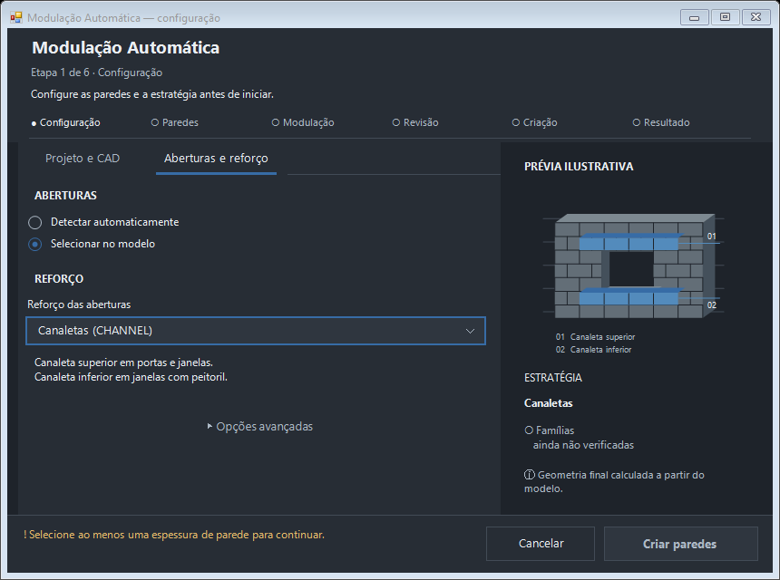

# Modulação Automática — redesign premium

```json
{
  "date": "2026-09-16",
  "scope": "current",
  "branch": "codex/modulation-ui-premium-redesign",
  "head": "ddb24c27b13d15ec0876ce0ece6ed5b35b4d8e36",
  "base": "55e990d962ed22ae1021f0d335db197607bddda1",
  "pr": "https://github.com/Arcanjog1/MeuBotao.pushbutton/pull/46",
  "objective": "Reconstruir a apresentação da Modulação Automática como tool dialog compacto: componentes, hierarquia, prévia, navegação e estados, preservando a execução e a física.",
  "changes": [
    "Abas por texto e sublinhado, stepper de seis etapas, escolhas de origem compactas e modo avançado recolhido.",
    "Seletores escuros com menu nativo, teclado e callbacks originais; validação curta no rodapé; configuração 860x640.",
    "Prévia vetorial com profundidade, abertura, canaletas superior/inferior, legenda e contexto sem falsa validação.",
    "Lista de famílias pronta/ausente/pendente; execução em tela dedicada; quantidades antigas ocultas durante reanálise; resultado com símbolos e relatório secundário.",
    "Responsividade por espaço e escala de fonte, ordem de Tab, contratos UI e evidência documental."
  ],
  "tests": [
    "HEAD ddb24c2: 312 passed / 1 warning, exit 0, captura 71.204 s; evidence/2026-09-16-premium-ui-verified-focused.json e .txt.",
    "Nove grupos de interação WinForms/pythonnet PASS, incluindo menu NONE/CHANNEL e Up/Down; docs/ui-premium-preview/interaction-checks.json.",
    "30 casos de configuração/revisão em 3 resoluções x 5 escalas de bounds e fontes: ação principal visível, dentro do rodapé e com tamanho mínimo em todos; matrix/results.json.",
    "188 definições fora da UI, handler completo e métodos protegidos de execução intactos; engine/benchmark/loader sem diff desde main ou #44."
  ],
  "known_failures": [
    "Smoke no botão real do Revit e DPI nativo do Windows não executados: nenhum conector Revit disponível e automação nativa do computador desabilitada nesta sessão.",
    "Suíte completa histórica de 76b758b: 1228 passed / 3 failed; TP1 V1 JUNCTION_MISSING_BINDING 8→9; TGD V2 compensators 61→62; UnboundLocalError ctypes no teste de GIL em Windows. Sem nova alegação de full-suite PASS.",
    "Barra de título, scrolls, checklist de espessuras e barra de progresso ainda usam partes do chrome nativo do Windows."
  ],
  "physical_deltas": ["Nenhum. Solver, B34/B54/B19, CHANNEL físico, prism, junction, aberturas, criação física, ETAPA 3B e golden/baseline preservados."],
  "decisions_taken": [
    "Nova branch da main buscada, reutilizando por fast-forward somente o trabalho UI anterior até 78a79fc; novo draft separado do #44, nenhum commit do #42.",
    "Manter CPython/pythonnet + WinForms. Os novos seletores são apresentação sobre a configuração existente, sem migrar runtime ou execução.",
    "Não simular percentuais, ajustes, famílias prontas ou validação física. Stepper descreve percurso, não certificação geométrica.",
    "Não alterar DPI do processo Revit nem configuração do sistema; reduzir contexto auxiliar em espaço pequeno."
  ],
  "decisions_pending": ["DPI nativo, smoke real em Revit/pyRevit e revisão visual humana antes de qualquer promoção."],
  "next_steps": ["Executar o checklist real no runtime de destino; reconciliar arquivos compartilhados quando o #42 estiver encerrado. Não mesclar sem autorização específica."],
  "references": [
    {"path": "docs/UI_PREMIUM_DESIGN.md"},
    {"path": "docs/UI_VISUAL_REFERENCE.md"},
    {"path": "docs/UI_REDESIGN.md"},
    {"path": "docs/PROJECT_STATUS.md"},
    {"path": "docs/checkpoints/evidence/2026-09-16-premium-ui-verified-focused.json"},
    {"path": "docs/checkpoints/evidence/2026-09-16-premium-ui-verified-scope.json"},
    {"path": "docs/ui-premium-preview/interaction-checks.json"},
    {"path": "docs/ui-premium-preview/matrix/results.json"},
    {"path": "docs/ui-premium-preview/manifest.json"}
  ]
}
```

## Veredito

**PARTIAL — LIMITATIONS EXPLAINED.** Redesign implementado e validado fora
do Revit, com diferença visual verificável. Não declarar READY: faltam
smoke do botão real e DPI nativo. Não houve merge, instalação na extensão
em uso ou alteração do PR #42. O #44 permanece como entrega anterior.

## 1. Base, branch e revisão

- Main inicial e buscada novamente antes da entrega: `55e990d962ed22ae1021f0d335db197607bddda1`.
- Branch: `codex/modulation-ui-premium-redesign`.
- HEAD de produção/testes avaliado: `ddb24c27b13d15ec0876ce0ece6ed5b35b4d8e36`.
- Tree: `6efdc8bf9a59a316f2ff0be2b528fa74dd28428b`.
- Checkout: `C:\Users\CIVIX\modulacao-ui-redesign`.
- Branch criada de origin/main, seguida de fast-forward dos commits de UI
  até `78a79fc`; nenhuma mudança experimental do #42 foi incorporada.
- Auditoria/wireframe anteriores à implementação desta rodada: `60411a3`.
- Commits de componentes/fluxo/QA/seletores/acabamento: `442b023`, `d094b5b`,
  `fd1e758`, `4c34efc`, `ddb24c2`. Commits seguintes são documentais/QA documental.

## 2. Referência efetivamente conferida

[Cotas e Detalhamento automático de Arquitetura no Revit — BIM Coder](https://www.youtube.com/watch?v=XRQ8CZEwTCE).
Nesta rodada, o vídeo foi aberto novamente e inspecionado visualmente em
**7:20** e **4:10**. O player confirmou os tempos; screenshots foram vistos
na sessão. Houve anúncio inicialmente, superado pela interação direta com
os controles do player. Não se afirma ter assistido a todo o vídeo.

4:10: janela técnica sobre o Revit, campos compactos à esquerda, preview de
cotas à direita, grupos por tarefa e Cancelar/Aplicar no rodapé. 7:20:
outra aba conserva superfícies escuras, alinhamento, seções, campos pequenos
e a mesma hierarquia. Nenhum logo, texto ou asset do autor foi reutilizado.
A aparência não comprova qual linguagem ou framework o autor usou.

### Comparação explícita após a implementação

| Aspecto | Referência | Redesign entregue | Limite restante |
|---|---|---|---|
| Hierarquia | Cabeçalho discreto, controles dominam | Título, etapa curta, stepper e conteúdo separado | Nosso cabeçalho é maior para comportar as seis etapas solicitadas |
| Densidade | Tool dialog sobre Revit | Configuração/revisão 860×640; fonte 860×570 | Seleção/CAD ainda percorrem diálogos e picker já existentes |
| Controles | Campos escuros uniformes | Seletor escuro com menu nativo; escolha e foco desenhados localmente | Checklist de espessura e scroll ainda nativos |
| Abas | Faixa compacta com seleção inequívoca | Texto + sublinhado, sem moldura de botão | Não reproduz a identidade da referência |
| Preview | Desenho contextual de cotas | Alvenaria, abertura, profundidade e reforços numerados | Ilustrativo; nunca é plano físico calculado |
| Rodapé | Cancelar e uma ação | Ação única azul e validação curta; execução com status | Tela de análise mantém cancelamento/pausa já existentes |
| Acabamento | Chrome escuro uniforme | Componentes coerentes em grafite | Título e barra de progresso ainda dependem do Windows |

## 3. Antes → depois e segunda revisão visual

Inventário completo, KEEP/IMPROVE/REMOVE/ADVANCED/REDESIGN e wireframe:
[UI_PREMIUM_DESIGN](../UI_PREMIUM_DESIGN.md). Inventário das funções e contratos
pré-existentes: [UI_REDESIGN](../UI_REDESIGN.md).

- Abas retangulares → texto com linha ativa e foco por teclado.
- Cabeçalho sem percurso → etapa atual e seis estados de percurso.
- Combos com molduras brancas → apresentação escura por menu/botão nativo,
  sincronizada com o ComboBox original que guarda seleção e eventos.
- Prévia retangular plana → desenho vetorial com faces, abertura e canaletas
  identificadas por 01/02; texto discreto explica o caráter ilustrativo.
- Famílias em texto corrido → lista com ✓ Pronta / ✕ Ausente; pendente continua
  pendente, mesmo quando parte do catálogo já foi carregada.
- “Falta: marque...” e resumo técnico extenso → mensagem de validação curta
  ou “Configuração pronta para criar paredes”.
- Tabela antiga durante novo cálculo → tela dedicada de atividade; somente
  resultados atuais reaparecem ao concluir.

Foram feitas múltiplas inspeções de renders, não só a primeira versão.
Correções decorrentes: preview sem área útil em painéis baixos; título
cortado em 200%; valores antigos durante execução; moldura branca de
seletores; espaço de cabeçalho de grid sem pintura; navegação de teclado.

## 4. Design system e arquitetura UI

Tokens: Surface0 `#1E232A`, Surface1 `#272D35`, Surface2 `#2F363F`, borda
`#424B56`, ação `#376CA6`, texto `#EAEEF3`, secundário `#ADB9C6`.
Spacing 4/8/12/16/20/24/32, alturas 28/32/36, raios definidos 4/6/8
(controles nativos mantêm formato próprio; não se alega raio aplicado a todos).
Segoe UI: título 14 pt, seção 10, corpo/campo/status 9, helper/caption 8.25.

| Camada | Responsabilidade |
|---|---|
| `ui_state.py` | Tokens, tradução, gates espelhados do backend, contagens e resultado |
| `ui_chrome.py` | Stepper, separadores, abas, glyphs e seletor/menu; sem Revit |
| `ui_preview_panel.py` | Desenho vetorial local, recursos gráficos descartados após pintura |
| `ui_native_style.py` | Cabeçalhos/células e estado disabled de controles nativos |
| `ui_components.py` | Configuração, origem, paredes, revisão, atividade e resultado |
| `wall_modeling.py` | Hooks de apresentação e mensagens; execução permanece no host |

Componentes: AppHeader/stepper, TabDeck, Field/dropdown, escolhas de origem,
Preview/contexto, MetricStrip, grid de famílias, IssueBanner/lista original,
disclosure, FooterActions e apresentação de progresso existente.
O relatório opcional `automatic_adjustments` tem apresentação somente quando
recebe dados; nenhum ajuste físico novo foi implementado ou inventado.

## 5. Fluxo e comportamento final

| Área | Comportamento |
|---|---|
| Configuração | Projeto/CAD e aberturas/reforço, preview à direita; rodapé explica botão disabled |
| Origem | CAD/existentes exclusivos; união de paredes dentro de Opções avançadas |
| Existentes | Picker Revit preservado; contagem real quando disponível e escolha NONE/CHANNEL |
| Aberturas | Detecção/seleção independentes do modo de referência; CHANNEL opt-in, LINTEL oculto |
| Paredes | Resumo denso e análise; pausa/cancelamento existentes preservados; análise pulada é informada |
| Modulação | Cálculo explícito; contagens de todas as fiadas materializadas, não multiplicação de A/B |
| Revisão | Pendências, famílias, tabela de peças, confirmação explícita da criação |
| Criação | Vista de atividade dedicada; nenhuma ação concorrente; quantidades/percentuais reais quando emitidos |
| Resultado | Símbolo + texto + cor, quantidades, falhas, revisão pendente e tempo; relatório expansível |
| Erros | Mensagem humana e próxima ação; código bruto/IDs em detalhes e tooltips |
| Logs / avançado | Recolhidos; preservam relatório original, referência e revisão humana |
| Lote existente | Atualizar modulação avisa substituição e mantém confirmação existente |

Não há animação ou timer novo. Eventos de grafo/catalogação recebem textos
humanos; silêncio do backend não gera percentuais falsos. A UI não pode
garantir ausência de congelamento do host sem testar o runtime real.

## 6. Screenshots finais

Todos os números são **dados sintéticos**: não constituem resultado de obra.
[Manifesto com SHA-256](../ui-premium-preview/manifest.json).

| Tela | Antes (#44) | Depois |
|---|---|---|
| Configuração | [Anterior](../ui-dark-preview/02-configuracao.png) | [Configuração](../ui-premium-preview/02-configuracao.png) |
| Aberturas/CHANNEL | [Anterior](../ui-dark-preview/08-channel.png) | [Aberturas](../ui-premium-preview/08-channel.png) |
| Origem/existentes | [Anterior](../ui-dark-preview/09-paredes-existentes.png) | [Existentes](../ui-premium-preview/09-paredes-existentes.png) |
| Paredes | [Anterior](../ui-dark-preview/03-paredes.png) | [Paredes](../ui-premium-preview/03-paredes.png) |
| Modulação | [Anterior](../ui-dark-preview/05-plano.png) | [Plano](../ui-premium-preview/05-plano.png) |
| Revisão | [Anterior](../ui-dark-preview/04-revisao.png) | [Revisão](../ui-premium-preview/04-revisao.png) |
| Criação | [Anterior](../ui-dark-preview/06-criacao.png) | [Atividade](../ui-premium-preview/06-criacao.png) |
| Resultado | [Anterior](../ui-dark-preview/07-resultado.png) | [Resultado](../ui-premium-preview/07-resultado.png) |

Também: [família ausente](../ui-premium-preview/10-familia-ausente.png),
[gate crítico](../ui-premium-preview/11-gate-critico.png),
[cancelamento](../ui-premium-preview/12-cancelamento.png).



## 7. DPI, resoluções, acessibilidade e teclado

Mínimo nominal 740×520; dimensões ajustadas à área disponível. Conteúdo com
scroll; rodapé fixo. Contexto/preview é recolhido quando o espaço lógico
fica insuficiente, em vez de cobrir campos ou truncar o título.

[Matriz de resultados](../ui-premium-preview/matrix/results.json): configuração
e revisão em **1366×768, 1920×1080 e 2560×1440**, em **100/125/150/175/200%**.
São 30 ensaios com bounds **e fontes** escalados. Os três checks da ação
principal passaram em todos. Inspeção visual incluiu 1366×768/200% e
1920×1080/150%, além dos renders normais e janela mínima.

**Limite:** não mudamos DPI do Windows. A matriz é stress test de layout,
não evidência de Per-Monitor DPI em Revit; não prova ausência de todo corte
em todas as configurações reais. Scripts não mudam o DPI do processo host.

TabIndex ordenado pela posição visual; seletor recebe Up/Down e Alt+Down;
Enter aciona botão focado/principal conforme navegação nativa; Esc fecha
menu ou cancela/fecha quando a ação está disponível. Estado ocupado remove
ações concorrentes. Nomes acessíveis, foco azul, símbolos e texto evitam
dependência exclusiva da cor. Leitor de tela completo ainda não ensaiado.

## 8. Testes e smoke

Comando final:

```text
py -3 -m pytest tests/test_ui_redesign.py tests/test_channel_ui_and_family_gate.py tests/test_script.py nuvem/tests/test_progress.py -q -p no:cacheprovider
```

**312 passed, 1 warning**, exit 0, HEAD `ddb24c2`; tempo da captura 71.204 s.
Windows/Python 3.14.6/pytest 9.1.1. Warning herdado de `codecs.open`.
[Metadados](evidence/2026-09-16-premium-ui-verified-focused.json),
[saída](evidence/2026-09-16-premium-ui-verified-focused.txt).
Capturas anteriores desta rodada permanecem rastreáveis; não substituem a final.

[Interação nativa](../ui-premium-preview/interaction-checks.json): Python 3.13,
pythonnet 3.1, WinForms real, fake Revit. Nove grupos PASS: seleção/menu,
teclado, previews, tabs, grupos de rádio, famílias, gates, relatório e cancelamento.
Os scripts de render usam DoEvents **somente no processo de QA isolado**.
Nenhuma chamada adicional foi inserida no plugin.

| Smoke solicitado | Ensaio local | Revit real |
|---|---|---|
| Abrir / tabs / configuração CAD | PASS de construção, valores e render | Pendente |
| Existentes / CHANNEL / família ausente | PASS de UI; picker não é simulado como Revit | Pendente |
| Análise / warning / solve / revisão | Estados e callbacks de fronteira testados | Pendente |
| Create / resultado / rerun | Estados, gates e substituição testados; sem criação real | Pendente |
| Cancelar | Semântica de UI testada, mantendo alterações já aplicadas | Pendente |

Nenhum conector Revit está disponível nesta sessão; automação nativa de
desktop está desabilitada. Não foi possível cumprir honestamente o smoke
integrado. Não iniciar outra instância nem instalar em produção para contornar.

Suíte completa anterior: [evidência histórica](evidence/2026-09-16-ui-redesign-suite.json),
1228 passed / 3 failed no HEAD `76b758b`. Não reexecutada integralmente aqui:
engine, benchmark e testes físicos continuam idênticos; testes relevantes
de integração do script e UI foram executados. Falhas históricas estão
listadas no JSON do checkpoint, sem alteração de baseline para ocultá-las.

## 9. Performance, escopo e conflitos

Abrir, trocar tabs e pintar preview só manipulam controles/dados já disponíveis.
Menu lê a lista já carregada; não consulta elementos nem executa solver.
Não há timers, workers, cache físico ou framework adicional.

[Prova AST/diff](evidence/2026-09-16-premium-ui-verified-scope.json):

- `nuvem/core/engine`, `nuvem/benchmark` e `Script.py`: nenhum diff desde main.
- 188 definições fora da UI intactas no módulo misto `wall_modeling.py`.
- `_PostCreationEventHandler` inteiro idêntico por AST.
- `_pump_ui`, `_invoke_if_needed`, `_on_watchdog_tick`, `stop_watchdog`, `close`
  idênticos; threading/pythonnet/GIL/ExternalEvent preservados.
- Nenhuma mudança física entre esta branch e a entrega anterior do #44.

Arquivos novos/modificados desta rodada: `ui_chrome.py`, `ui_components.py`,
`ui_preview_panel.py`, `ui_native_style.py`, `ui_state.py`; mensagens de
`_SetupForm` em `wall_modeling.py`; contratos em `test_ui_redesign.py` e
expectativa de apresentação em `test_script.py`; regra UX-20260916;
scripts `render_premium_states.py`/`render_premium_matrix.py`, design e evidências.
Os demais deltas desde main são herdados e documentados na entrega do #44.

Possíveis conflitos com #42: `wall_modeling.py` (arquivo misto),
`REGRAS_MODULACAO_BLOCOS.md`, `test_script.py`, `PROJECT_STATUS.md` e log.
Novos módulos UI não têm contraparte no snapshot anterior do #42.
Não foi feito polling do PR, merge experimental ou resolução antecipada.
Reconciliar semanticamente após o encerramento da sessão física.

## 10. Draft e fechamento

[PR #46 draft](https://github.com/Arcanjog1/MeuBotao.pushbutton/pull/46), separado e contra main, sem merge.
O status oficial continua main `55e990d`; esta UI é candidata.
O arquivo `UI_PREMIUM_DESIGN.md`, esta comparação, as imagens e o manifesto
cobrem os 36 itens de entrega, distinguindo implementação, ensaio e pendência.
